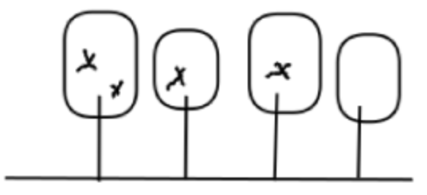
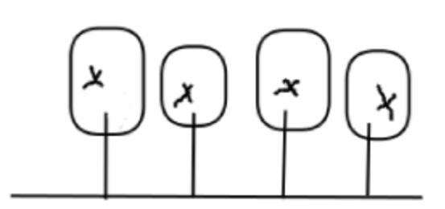
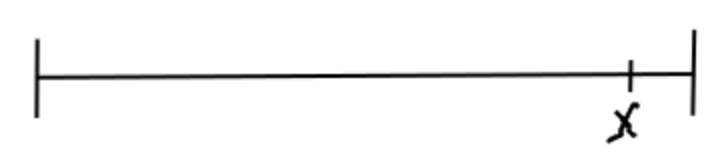

# Disrcete Mathematics

- [Lecture 0 Introduction to propositional logic](#Lecture0)
- [Lecture 1 First order logic, start of proofs](#Lecture1)
- [Lecture 2 All proof techniques except induction](#Lecture2)
- [Lecture 3 Induction proofs](#Lecture3)
- [Lecture 4 Set theory - basic notations](#Lecture4)

##  Lecture 0 6/9/22 Intro, propositional logic (Book/Lecture Notes: 1.1, 1.2, 1.3)
### Integers
- Whole numbers
- Symbol: ℤ

### Natural Numbers
- All integers greater then 1
- 0 is not a natural number (in this course atleast)
- Symbol: ℕ

### Rational Numbers
- Any number that can be written as a/b where a and b are both integers and b is not equal to 0.
- Symbol: Q

### Real Numbers
- Basicly all numbers. 
- Every possible number.
- Symbol: ℝ

### Divisibility
- m is divisible by k if there is an integer n such that mInduction proofs = k * n

### Odd numbers
- Any integer not divisble by 2
- n is odd if you can write it as n = 2m + 1

### Even numbers
- Any integer divisibl by 2
- n is even if you van write it as n = 2 * m
- 0 is an even number

### Perfect Square
- A product of an integer with itself

### Prime numbers
- Any natural number greather or equal to 2, which is oly divisible by itself and 1

### Statements
- Either true or false

### Proposition
#### Negation(NOT)
- not
- the negation for propostion p is not p

#### Conjunction(AND)
- and
- p AND q is true if both p and q are true.
- if one of them is false the statement is false

#### Disjunction(OR)
- or
- p OR q is true whenever p or q is true.
- p OR q is only false when both p and q are false.

#### Compound propositions
- p means "2 is an odd number" (FALSE)
- q means "37 is a prime number" (TRUE)
- r means "Maastricht is in Lumburg" (TRUE)

So:
- p and q or r  = TRUE
- (p and q) or r = TRUE
- p and (q or r) = FALSE

### Truth tables
- Truth tables allow us to systematially understand when a proposition is true or false

- [insert immages for truthtables for TRUE, FALSE, AND and OR]
#### Tautology
- This happens when the whole truth table turns out TRUE

#### Contradiction
-This happens when the whole truth table turns out FALSE

#### Conditional statements
##### Conditional
- if p then q
- if --> q
- "p implies q"
- if p exists then q does so
- this statement is only false is p is true and q is false
- Use the drinking beer example

##### Biconditional
- p if and only if q
- p <--> q
- p iff q
- p only excists when q excists
- This statement is only TRUE when both are TRUE or FALSE

##  Lecture 1 7/9/22 First order logic, start of proofs (Book/Lecture Notes: 1.4, 1.5)

### Quaintifiers
- For all symbol: ∀
- There exists: ∃
**Examples:**
- (∀ elephants)(elephants has trunk) TRUE
- (∀ students)(students likes banana) FALSE
- (∃ even prime number)(number bigger than 2) FALSE
- (∀ balls in box)(balls are red) TRUE (if there are no balls in box)
- (∃ ball in box)(ball is red) FALSE (if there are no balls in box)

- To disprove a statement you have to prove the negation of that statement.

**Some other examples**
"All integers are bigger than 5", can also be written as:
- (∀ integers)(integer > 5)
- (∀x ∈ ℤ)(x > 5)
- ∀x ∈ ℤ : x > 5

"Some realnumber is smaller than 3", can also be written as:
- (∃ realnumber)(realnumber < 3)
- (∃x ∈ ℝ)(x < 3)
- ∃x ∈ ℝ : x < 3

**Now try and write the oppisite:**
P: (∀ elephants)(elephant has trunk):
- ¬P : ¬[(∀ elephants)(elephant has trunk)]
- ¬P : (∃ elephant)(elephant has no trunk)

Conlusion: To negate, you flip the quantifier and you negate the body.

### Higher depth quantifiers

**Example**
(∃ tree t)(∀ monkeys m)(m climbs t) FALSE  
because: 

(∀ monkeys m)(∃ trees t)(m climbs t) TRUE  
because: 

**Negation of example:**
P: (∃ tree t)(∀ monkeys m)(m climbs t):
- ¬P: [(∃ tree t)(∀ monkeys m)(m climbs t)]
- ¬P: (∀ trees t)(∃ monkey m)(m does not climb t)

### Direct proof
**Example 1**  
(∀x ∈ ℤ)(∃y ∈ ℤ)(3x + y <= 4) which is TRUE 
*proof by direct proof:*   
<ins>let</ins> x ∈ ℤ <ins>take</ins> y = 3-3x  
(y ∈ ℤ because x = ℤ)  
<ins>then</ins> 3x+y=3x+(3-3x) = 3 <= 4 which completes the proof.

**Example 2**  
(∃x ∈ ℤ)(∀y ∈ ℤ)(3x + y <= 4) which is FALSE 
*proof by direct proof:* 
first we negate the proposition (WHY?) Sometimes to prove a proposition you have to disprove the negation of that proposition. In this case we have to disprove the propositio, so we are gonna prove the negation of the proposition.  
(∀x ∈ ℤ)(∃x ∈ ℤ)(3x + y > 4)  
<ins>let</ins> x ∈ ℤ <ins>take</ins> y = 5-3x
<ins>then</ins> 3x + (5-3x) > 4 = 5 > 4 is TRUE, which means that the orignal proposition is FALSE  
which completes the proof.

### Proof by Counter Example
**Example 1**  
(∀x ∈ ℤ)(∃y ∈ ℕ)(3x + y > 4)  TRUE  
*disprove by counter example:*  
<ins>Take</ins> x = 5  
<ins>Then</ins> for all natural numbers y we have 3x + y >= 15 + 1 (because y is ℕ) = 16 > 4 wich completes the prove.

**Example 2** 
(∀x ∈ ℝ)(∃y ∈ ℤ)(3x + y <= 4)  
*disprove by counter example* 
<ins>let</ins> x ∈ ℝ: <ins>take</ins> y = ⌊3-3x⌋ (This is a flooring function, this roundsdown the function and will always be smaller then 3-3x. We have to do this because y cant by in ℤ because x is in ℝ)   
<ins>then</ins> 3x + y = 3x + ⌊3-3x⌋   
<= 3x + 3 - 3x = 3 <= 4 Whih is TRUE and completes the proof.

##  Lecture 2 8/9/22 All proof techniques except induction (Book/Lecture Notes: 1.5)
### Proof by contradiction 
If we prove by contradiction you try to prove ¬P = FALSE instead of p = TRUE. 
You can do thi by assuming ¬P = TRUE and applying logical consequences to arrive at a contradiction. 

**Example 1**
*Prove that there is an infinite number of primes* 
<ins>First</ins> try to prove the negation of the propisition.  
<ins>Assuming</ins>there is an infinite number of primes  
<ins>Then</ins> the contradiction is thath there is a biggest prime. 
<ins>let</ins> n ∈ Primes such that prime n = biggest prime.  
{p1, p2,p3,.....} = {2,3,5,..,pn} 
consider the following number:  
N = p1 · p2 · p3 · . . . ·pn + 1 = 2 · 3 · 5 · . . . · pn + 1 
So N is the product of all prime numbers + 1. 
Then N is not divisible by 2, 3, 5, 7, and eventually pn. 
This means N is not divisble by any prime number. 
Since every natural number >= 2 that is not a prime can be written as a product of prime factors, N is a prime number itself. 
This however contradicts the assumption that pn is the biggest prime number because N is much bigger. 
*Conclusion:* 
So the propisition we tried to prove is FALSE, which means that there are infinite prime numbers thus the proof completes.

**Example 2**
Prove that there is no biggest number smaller then 1. 
Negation = there is a biggest number x smaller then 1. 

<ins>let</let> x < 1 <ins>take</ins>y=(x+1)/2 
<ins>then</ins> y > (x+x)/2 = 2x/2 = x, So y > x 
This already tells us there is a bigger number then x, but we still have to prove y is smaller then 1. 
y < (1 + 1)/2 = 1, So y is smaller then 1 
x < y < 1. This proves that there is a biggest number than the biggest number we thought was te biggesst number.  
So it disproves our assumption and proves the initial proposition. Which completes the proof.

##  Lecture 3 13/9/22 Induction proofs (Book/Lecture Notes: 1.6)

##  Lecture 4 14/9/22 Set theory - basic notations (Book/Lecture Notes: 2.1, 2.2)

